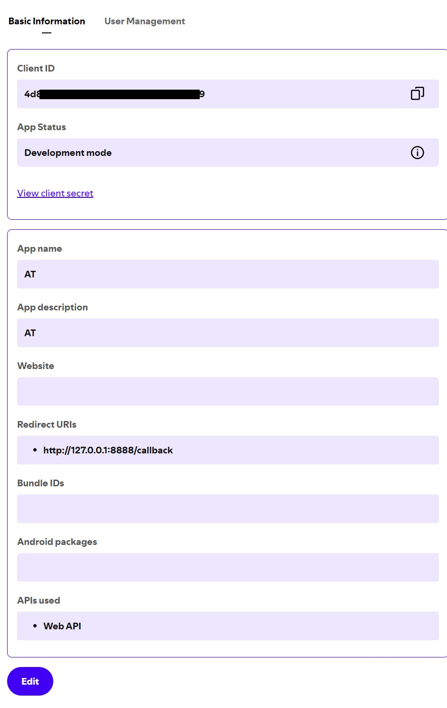

# spotify-access-token
Python script to get an access token for Spotify's Web API via the Authorization Code PKCE flow.


#### Prerequisites
- Python 3.7+ installed
- pipenv installed (install with: `python -m pip install --user pipenv`)
- An app registered in your [Spotify developer dashboard](https://developer.spotify.com/dashboard)

#### Registering your Spotify app and retrieving credentials

1. Go to the [Spotify Developer Dashboard](https://developer.spotify.com/dashboard).
2. Log in with your Spotify account.
3. Click **Create app** (or **Create an app**).
4. Enter an **App name** and **App description**.
5. Set the **Redirect URI** to `http://127.0.0.1:8888/callback` and save it.
6. After the app is created, open it from the dashboard:
   - The **Client ID** is shown on the app’s main page.
   - Click **Show Client Secret** to reveal the **Client Secret**.
7. Use these values as the `--client_id` and `--client_secret` arguments when running the script.

It should look like this:


### Project setup
1. Clone the repository and change into the project directory:<br>
    `git clone <repo-url>`<br>
    `cd <repo-directory>`

2. Install project dependencies from the Pipfile:
    <br>`pipenv install`


### How to use

```sh
usage: pipenv run python get_spotify_token.py [-h] --client_id CLIENT_ID [--client_secret CLIENT_SECRET] [--scope SCOPE]

Get Spotify Access Token via PKCE

options:
  -h, --help            show this help message and exit
  --client_id CLIENT_ID
                        Spotify Client ID
  --client_secret CLIENT_SECRET
                        Spotify Client Secret
  --scope SCOPE         Space separated scopes
```

#### Example usage

```sh
pipenv run python get_spotify_token.py --client_id ID --client_secret SECRET
```

```sh
pipenv run python get_spotify_token.py --client_id ID --client_secret SECRET --scope "user-read-private user-library-read"
```

#### Scopes

[Spotify scopes documentation](https://developer.spotify.com/documentation/web-api/concepts/scopes)
